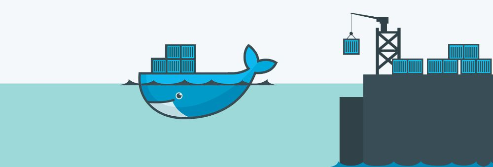

<h1 align="center">
راه‌اندازی استک نرم‌افزاری
MySql/Asp.Net Core/PHP/Redis 
توسط داکر
</h1>

<i>
  نویسندگان:
  <a href="https://github.com/ahmadsalimi">
  احمد سلیمی
  </a>
</i>

داکر یه پلتفرم متن‌باز برای توسعه
(development)
و استقرار
(deployment)
نرم‌افزارهاست. تو داکر هر سرویس یا نرم‌افزار رو میشه روی یک محیط ایزوله که بهش
Container
گفته میشه اجرا کرد که کاراییشون به شدت از ماشین‌های مجازی بهتره

